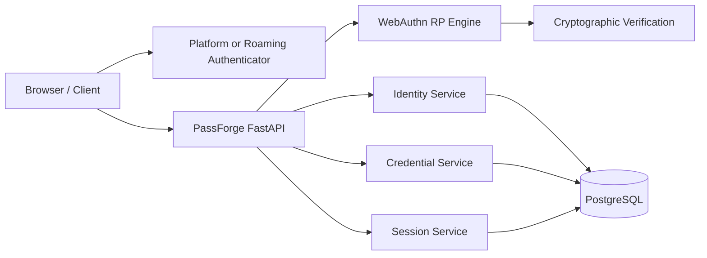

# PassForge

PassForge is an independent, specification-driven Python implementation of a WebAuthn/FIDO2 Relying Party and identity server.

The project is built with **Python** and **FastAPI**, with an emphasis on:

- Protocol correctness
- Security
- Interoperability
- Specification traceability
- Independent implementation
- Open-source usability

## Project Status

**Pre-alpha / active development**

PassForge is not intended for production authentication workloads yet. Development is progressing incrementally against the relevant W3C WebAuthn and FIDO specifications.

**Current target:** `v0.1 MVP`

## Objectives

1. Build a practical WebAuthn/FIDO2 identity server using Python and FastAPI.
2. Learn the underlying WebAuthn, FIDO2, cryptographic, and identity concepts through implementation.
3. Provide an independent open-source implementation that developers can study, run, and extend.
4. Build a security-focused and interoperable foundation suitable for future production hardening.

## Scope

### MVP In Scope

- WebAuthn registration
- WebAuthn authentication
- Passkeys / discoverable credentials
- Credential lifecycle management
- Relying Party validation
- Challenge management
- Cryptographic verification
- User identity management
- Session management
- Security auditing
- Interoperability testing
- REST APIs
- PostgreSQL persistence
- Automated protocol and security testing

### Explicitly Out of Scope for MVP

- FIDO authenticator implementation
- CTAP transport implementation
- SAML
- SCIM
- Enterprise IAM
- Multi-region infrastructure
- Mobile SDKs
- Formal FIDO certification

PassForge focuses on the **WebAuthn Relying Party/server side**. Browser and client platforms mediate communication with authenticators.

## Architecture



## Technology Stack

- Python
- FastAPI
- PostgreSQL
- Alembic
- pytest
- Docker
- WebAuthn / FIDO2 specifications
- Cryptographic libraries selected based on security and protocol requirements

Dependencies should remain minimal and justified by security, correctness, interoperability, or operational needs.

## Standards Baseline

Primary normative references:

- [W3C Web Authentication (WebAuthn) Level 3](https://www.w3.org/TR/webauthn-3/)
- [FIDO2 Specifications](https://fidoalliance.org/specifications/)
- [FIDO Server Requirements](https://fidoalliance.org/certification/functional-certification/functional-certification-servers/)
- Relevant IETF RFCs
- Relevant IANA registries

The exact specification revision used for each implementation milestone is recorded in the project documentation.

## Specification Traceability

PassForge follows a specification-first development model:

```text
Normative Specification
        ↓
Requirement
        ↓
Design Decision
        ↓
Implementation
        ↓
Unit / Protocol Test
        ↓
Security Test
        ↓
Interoperability Test
```

Major protocol behaviors are mapped to their normative source.

See:

- `docs/standards/REFERENCES.md`
- `docs/standards/STANDARDS_BASELINE.md`
- `docs/standards/TRACEABILITY.md`
- `docs/decisions/`

## Independent Implementation

PassForge is an independently developed implementation.

The normative specifications are the primary source of protocol behavior. Other implementations may be used for:

- Behavioral comparison
- Black-box interoperability testing
- Understanding expected protocol behavior

PassForge code must not be copied, translated line-by-line, or reproduced from another implementation.

See `PROVENANCE.md` for the project's implementation provenance policy.

## Security

Security is a core project objective.

The project explicitly considers threats including:

- Challenge replay
- Origin manipulation
- RP ID confusion
- Credential replay or cloning
- Account enumeration
- Malformed authenticator data
- Signature verification bypass
- Algorithm confusion
- Session theft
- Database compromise

See:

- `SECURITY.md`
- `docs/security/THREAT_MODEL.md`
- `docs/standards/SECURITY_REQUIREMENTS.md`

PassForge is pre-alpha and makes no production security guarantees at this stage.

## Development Roadmap

### Month 1 — Foundation

- FastAPI application foundation
- PostgreSQL and Alembic
- Testing framework
- Standards baseline
- CBOR / COSE / base64url foundations
- WebAuthn data model
- Specification traceability

### Month 2 — Registration

- Registration options
- Challenge lifecycle
- `clientDataJSON` validation
- `authenticatorData` processing
- Credential public key handling
- Attestation baseline
- Credential persistence
- Browser integration

### Month 3 — Authentication

- Authentication options
- Assertion parsing
- Signature verification
- RP ID validation
- Origin validation
- User Presence / User Verification
- Signature counter handling
- Discoverable credentials
- Session creation

### Month 4 — Security, Interoperability and MVP

- Negative testing
- Property-based / fuzz testing
- Browser and platform interoperability testing
- Threat-model validation
- Performance baseline
- FastAPI reference application
- Documentation
- `v0.1.0` release

## Project Guardrails

1. **Primary objective:** Build a Python/FastAPI WebAuthn/FIDO2 identity server.
2. **Normative source:** W3C and FIDO specifications take precedence over secondary sources.
3. **Independent implementation:** Do not copy or translate implementation code from other projects.
4. **MVP boundary:** Focus on registration, authentication, credentials, identity, sessions, security, and interoperability.
5. **No unsupported claims:** Do not claim formal W3C/FIDO certification or conformance without completing the applicable process.
6. **Scope control:** A feature must directly improve WebAuthn/FIDO implementation, identity capability, security, or interoperability. Otherwise, defer it.
7. **Technology stability:** Avoid technology changes that do not provide clear project value.

See `PROJECT_GUARDRAILS.md`.

## Contributing

Contributions are welcome.

Protocol-related changes should identify:

1. Relevant specification requirement
2. Design decision
3. Associated tests
4. Interoperability implications

See `CONTRIBUTING.md`.

## License

PassForge is released under the [Apache License 2.0](LICENSE).

The project is open source and may be reused under the terms of that license.

## Disclaimer

PassForge is an independent open-source project and is not affiliated with, endorsed by, or certified by the W3C or FIDO Alliance unless explicitly stated in project documentation.
