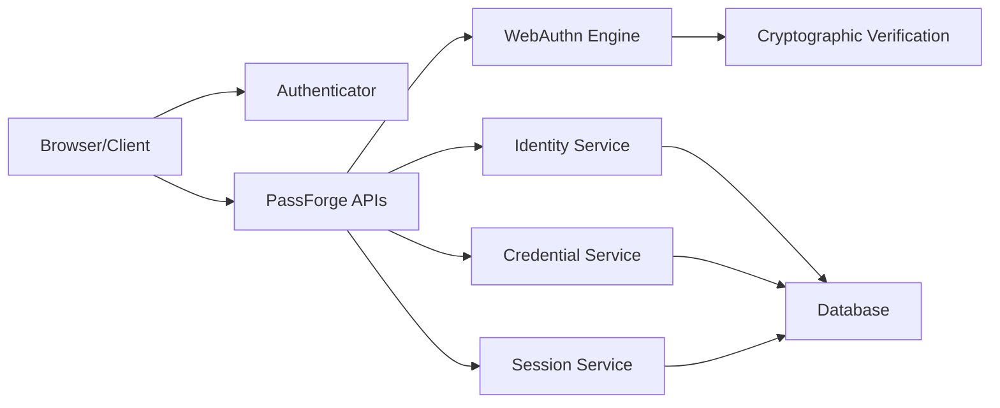

### PassForge

PassForge is an independent, Python based implementation of WebAuthn/FIDO2 Identity Server.

The project is built primarily using the FAST API and Python. For more inforamtion on the Tech Stack refer to the section below.

### Project Status

> Current status - Pre-ALPHA. 

The project is currently in a pre-alpha phase and not to used for production purposes.
Development is in progress using the current WebAuthn/FIDO2 specification.

Current Target - Initial release - `V0.1 MVP`

### Objectives

- Develop a WebAuthN/FIDO2 Server using Python and FAST API.
- Study and Learn concepts such as WebAuthn/FIDO2, Registration, Authentication, Attestation, Assertion, Cryptographic and Identity Concepts using practical implementation.
- Provide an Open Source Implementation that the community can use and contribute to.

### MVP - SCOPE
- CBOR and COSE
- WebAuthn/FIDO2 Registration
- WebAuthn/FIDO2 Authentication
- Credentials Discovery
- Credentials Lifecycle Management
- Challenge Management
- Identity Management
- Sensitive Data Management at REST and Transit.
- Cryptography Validation + Verification - Attestation and Assertion
- RP Validation
- Session Management
- REST APIs

### Out of Scope
- Authenticator Implementation
- CTAP Transport
- SAML
- SCIM
- Enterprise IAM
- Mobile SDKs
- Frontend SDKs
- Formal FIDO Certification
- Multi-Region Infrastructure

PassForge focuses on providing the implementation for WebAuthn/FIDO2 Identity Server. Communication with authenticators is handled by browser and client applications.

### Architecture Diagram


### Technology Stack
- Python 3.11+
- PostgreSQL
- FastAPI
- Pydantic 2
- Alembic
- pytest
- Docker
- WebAuthn/FIDO2 Specifications 
- Cryptographic Libraries, Depending on the requirements for cryptographic verification and validation.

Keep dependencies to minimal, should justify - security, correctness, operational needs, interoperatbility.

### Standards Baseline

Primary normative references:

- [W3C Web Authentication (WebAuthn) Level 3](https://www.w3.org/TR/webauthn-3/)
- [FIDO2 Specifications](https://fidoalliance.org/specifications/)
- [FIDO Server Requirements](https://fidoalliance.org/certification/functional-certification/functional-certification-servers/)
- Relevant IETF RFCs
- Relevant IANA registries

The exact specification revision used for each implementation milestone is recorded in the project documentation.

### Independent Implementation 
- [PROVENANCE.md](docs/governance/PROVENANCE.md)

### Security
This is a pre-alpha release, threats and vulnerabilities considered. No Guarantees Yet.
- [Security.md](./SECURITY.md)

### Roadmap
```text
Foundational -> Registration -> Authentication ->Security/Interoperability
```
For more information - [Traceability](./docs/standards/TRACEBILITY.md)

### Contributing
- [CONTRIBUTING.md](./CONTRIBUTING.md)

### License
PassForge is released under the [Apache License 2.0](LICENSE).

The project is open source and may be reused under the terms of that license.

### Disclaimer

PassForge is an independent open-source project and is not affiliated with, endorsed by, or certified by the W3C or FIDO Alliance unless explicitly stated in project documentation.
